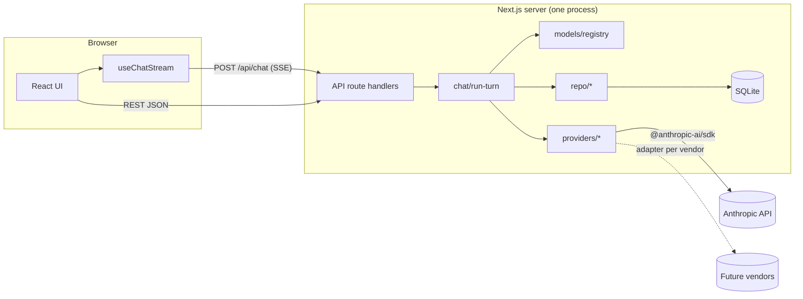
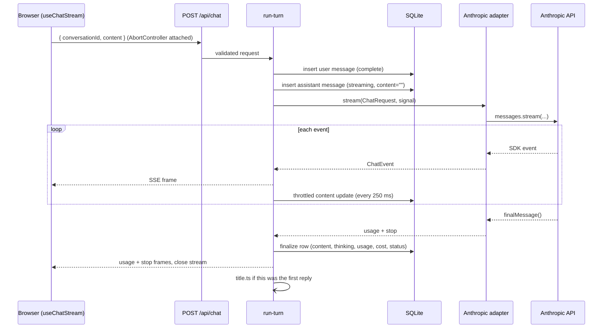
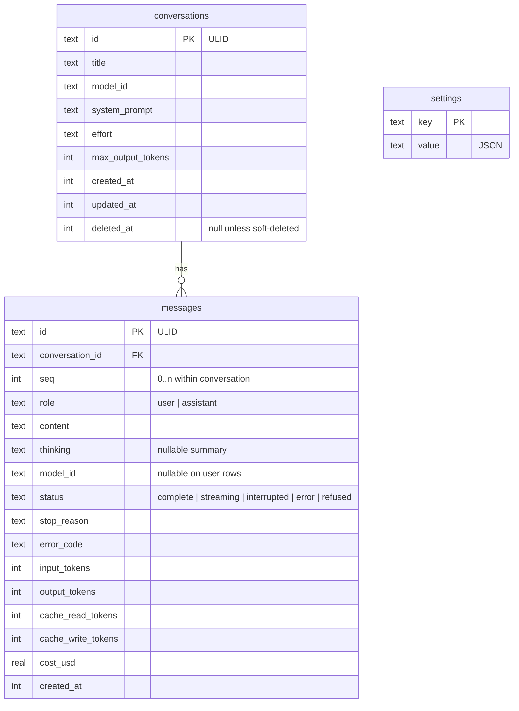

# Zeus Chat — Architecture

| Field | Value |
|---|---|
| Status | Draft v0.1, matches [PRD](PRD.md) v0.1 |
| Last updated | 2026-09-05 |

## 1. Overview

Zeus Chat is a single Next.js application. The browser talks only to the app's own API routes. API routes talk to model vendors through a provider adapter interface and persist everything in a local SQLite database. There is no separate backend process, queue, or cache service.



Three rules hold the design together:

1. **Vendor SDKs are imported only inside `src/lib/providers/`.** Everything else works with normalized types.
2. **The model registry is the single source of truth** for model IDs, prices, limits, and capabilities.
3. **Secrets live in server environment variables** and are read by one module, `src/lib/env.ts`.

## 2. Stack

| Concern | Choice | Why |
|---|---|---|
| Framework | Next.js (App Router), React, TypeScript strict | One process serves UI and API; route handlers support streaming responses natively |
| Package manager | pnpm | Already installed on the dev machine; fast, strict lockfile |
| Model SDK | `@anthropic-ai/sdk` | Official SDK; typed stream events, typed errors, `finalMessage()` |
| Database | SQLite via `better-sqlite3`, schema and migrations via Drizzle ORM | Local-first, zero services, synchronous writes are fast enough and simplify crash safety |
| Search | SQLite FTS5 virtual table | Full-text search over titles and message bodies without another service |
| Validation | Zod | Request bodies, env vars, and SSE payloads share schemas |
| Markdown | `react-markdown` + `remark-gfm` + `rehype-sanitize` + Shiki for code | Sanitized rendering of untrusted model output |
| Tests | Vitest for unit and integration; Playwright reserved for later e2e | Fast, TypeScript-native |
| Lint / format | ESLint (next config) + Prettier | Standard |

Versions are pinned in `package.json`. Do not pin them in docs.

## 3. Directory layout

```
zeus-agent/
├── docs/
│   ├── PRD.md
│   └── ARCHITECTURE.md
├── src/
│   ├── app/                          # Next.js App Router
│   │   ├── layout.tsx
│   │   ├── page.tsx                  # redirects to newest conversation or empty state
│   │   ├── c/[id]/page.tsx           # conversation view
│   │   └── api/
│   │       ├── chat/route.ts                     # POST — stream one turn as SSE
│   │       ├── conversations/route.ts            # GET list, POST create
│   │       ├── conversations/[id]/route.ts       # GET, PATCH, DELETE
│   │       ├── conversations/[id]/export/route.ts# GET ?format=md|json
│   │       ├── models/route.ts                   # GET registry (public fields only)
│   │       └── settings/route.ts                 # GET, PATCH
│   ├── components/
│   │   ├── chat/         # MessageList, Message, Composer, ThinkingDisclosure, UsageBadge, ErrorCard
│   │   ├── sidebar/      # ConversationList, SearchBox, NewChatButton
│   │   └── ui/           # buttons, menus, dialogs
│   ├── hooks/
│   │   └── use-chat-stream.ts        # fetch + ReadableStream + AbortController
│   └── lib/
│       ├── env.ts                    # zod-validated process.env, server only
│       ├── errors.ts                 # ChatError codes (vendor-neutral)
│       ├── http.ts                   # same-origin gate, JSON error helper
│       ├── cost.ts                   # usage × registry prices (M3)
│       ├── models/
│       │   └── registry.ts           # ModelSpec[] — the source of truth
│       ├── providers/
│       │   ├── types.ts              # ChatProvider, ChatRequest, ChatEvent
│       │   ├── index.ts              # getProvider(vendor)
│       │   ├── availability.ts       # isVendorAvailable(vendor) — env only, no SDK
│       │   └── anthropic.ts          # the only file that imports @anthropic-ai/sdk
│       ├── chat/
│       │   ├── run-turn.ts           # orchestrates persist → stream → persist (M1)
│       │   ├── sse.ts                # ChatEvent → SSE frames (server)
│       │   ├── sse-parse.ts          # SSE frames → ChatEvent (browser)
│       │   └── title.ts              # auto-title after first reply (M2)
│       ├── db/
│       │   ├── schema.ts             # Drizzle tables
│       │   ├── client.ts             # singleton connection, WAL mode
│       │   └── migrations/
│       └── repo/
│           ├── conversations.ts
│           ├── messages.ts
│           ├── settings.ts
│           └── search.ts
├── scripts/
│   └── mock-anthropic.mjs            # local Messages-API mock: run the UI with no key
├── data/                             # zeus.db lives here (gitignored)
├── AGENTS.md
├── CLAUDE.md
└── README.md
```

Tests sit next to the code they cover as `*.test.ts`.

## 4. Provider abstraction

### 4.1 Types

```ts
// src/lib/providers/types.ts
export type Vendor = "anthropic"; // union grows as adapters are added

export type Effort = "low" | "medium" | "high" | "xhigh" | "max";

export interface ModelSpec {
  id: string;                 // vendor model ID, e.g. "claude-sonnet-5"
  vendor: Vendor;
  displayName: string;
  contextWindow: number;      // input tokens
  maxOutputTokens: number;
  pricePerMTok: { input: number; output: number }; // USD
  capabilities: {
    thinking: boolean;
    effort: boolean;
    vision: boolean;
    tools: boolean;
    caching: boolean;
    sampling: boolean;        // temperature / top_p; false on Sonnet 5
  };
}

export interface ChatMessage {
  role: "user" | "assistant";
  content: string;            // v1 is text only; attachments extend this in v1.1
}

export interface ChatRequest {
  model: ModelSpec;
  system?: string;
  messages: ChatMessage[];
  effort?: Effort;
  maxOutputTokens: number;
  thinkingDisplay: "summarized" | "omitted";
}

export interface Usage {
  inputTokens: number;
  outputTokens: number;
  cacheReadTokens: number;
  cacheWriteTokens: number;
}

export type StopReason = "end" | "max_tokens" | "context_exceeded" | "refusal" | "cancelled" | "error";

export type ChatEvent =
  | { type: "message_start"; providerMessageId?: string }
  | { type: "thinking_delta"; text: string }
  | { type: "text_delta"; text: string }
  | { type: "usage"; usage: Usage }
  | { type: "stop"; reason: StopReason; details?: { category: string | null; explanation?: string } }
  | { type: "error"; code: ChatErrorCode; message: string; retryable: boolean };

export interface ChatProvider {
  vendor: Vendor;
  stream(req: ChatRequest, signal: AbortSignal): AsyncIterable<ChatEvent>;
  /** Optional: cheap count for the composer's token estimate. */
  countTokens?(req: ChatRequest): Promise<number>;
}
```

The event stream is the whole contract. The UI, the SSE encoder, and the persistence layer consume `ChatEvent` and never see vendor payloads. Tool-use events are deliberately absent in v1; when they arrive in v2 they are added to the union and every consumer is updated in one PR.

### 4.2 Anthropic adapter

`src/lib/providers/anthropic.ts` builds one request per turn:

| Field | Value | Reason |
|---|---|---|
| `model` | `req.model.id` | From the registry, never hard-coded |
| `max_tokens` | `req.maxOutputTokens` | Streaming, so large values are safe |
| `system` | `[{ type: "text", text, cache_control: { type: "ephemeral" } }]` | Explicit breakpoint on the stable prefix |
| `messages` | mapped from `req.messages` | First message must be `user`; the repo layer guarantees this |
| `thinking` | `{ type: "adaptive", display: req.thinkingDisplay }` | Sonnet 5 only accepts adaptive; default display is omitted, so summarized must be set explicitly to show reasoning |
| `output_config` | `{ effort: req.effort }` when set | Effort lives inside `output_config`, not top level |
| `cache_control` (top level) | `{ type: "ephemeral" }` | Automatic caching for the growing conversation tail |
| request options | `{ signal }` | Cancellation from the Stop button and client disconnects |

Never sent: `temperature`, `top_p`, `top_k` (rejected on Sonnet 5), `budget_tokens` (rejected), and assistant prefill (rejected). The `sampling` capability flag exists so a future adapter can expose those where a model supports them.

Event mapping:

| SDK stream event | `ChatEvent` |
|---|---|
| `message_start` | `message_start` with the message ID |
| `content_block_delta` / `thinking_delta` | `thinking_delta` |
| `content_block_delta` / `text_delta` | `text_delta` |
| `message_delta` | buffered; final `usage` and `stop` are emitted from `finalMessage()` so cache token fields are complete |
| `stop_reason: end_turn` or `stop_sequence` | `stop { reason: "end" }` |
| `stop_reason: max_tokens` | `stop { reason: "max_tokens" }` |
| `stop_reason: model_context_window_exceeded` | `stop { reason: "context_exceeded" }` |
| `stop_reason: refusal` | `stop { reason: "refusal", details: stop_details }` |
| `stop_reason: tool_use` or `pause_turn` | `error { code: "unsupported_stop" }` — cannot occur without tools in v1 |
| abort signal fired | `stop { reason: "cancelled" }` |

Error mapping uses the SDK's typed classes, most specific first: `AuthenticationError` and `PermissionDeniedError` → `auth`, `RateLimitError` → `rate_limit`, `BadRequestError` → `bad_request`, `APIConnectionError` → `network` (retryable), any other `APIError` with status ≥ 500 → `server` (retryable). No string matching on error messages. The SDK retries 429/5xx twice with backoff before the error reaches the adapter, so a `server` event means three attempts already failed.

Cancellation is belt and braces: the route wires both `request.signal` (client disconnect) and the SSE stream's `cancel()` (consumer stopped reading) to one `AbortController`, which is passed to the SDK as the request `signal`. Verified end to end against the mock server: a client that drops mid-stream closes the upstream socket within a second.

Model-specific notes for Sonnet 5 that the adapter relies on:

- Mid-conversation `role: "system"` messages are not supported. System prompt changes go through top-level `system`, which invalidates the cache for that conversation once. Acceptable.
- Server-side compaction (`compact-2026-01-12` beta) is supported and is the planned answer to conversations approaching the context window. Not enabled in v1; see PRD open question 4.
- Web search (`web_search_20260209`) is supported and is the v2 path for US-20.

### 4.3 Adding a provider

1. Add the vendor to the `Vendor` union and its models to `registry.ts` with accurate prices and capability flags.
2. Create `src/lib/providers/<vendor>.ts` implementing `ChatProvider`. Map the vendor's stream into `ChatEvent`. Map its errors into `ChatErrorCode`.
3. Register it in `providers/index.ts`.
4. Add the key name to `env.ts` (optional variable; the provider is listed as unavailable in `/api/models` when its key is absent).
5. Write `<vendor>.test.ts` that feeds a recorded event fixture through the adapter and asserts the `ChatEvent` sequence.

Nothing outside `src/lib/providers/`, `registry.ts`, and `env.ts` should change. The PRD tracks this as a success metric.

## 5. A chat turn end to end



Behaviour at the edges:

- **Stop button.** The client aborts the fetch. The route handler's `request.signal` fires, run-turn aborts the provider, the assistant row is finalized as `interrupted` with whatever text arrived. Partial usage is unknown for interrupted turns and is recorded as null, not zero.
- **Process crash mid-stream.** The throttled update means at most 250 ms of text is lost. On next load, rows still marked `streaming` are flipped to `interrupted` by a startup sweep in `db/client.ts`.
- **Vendor error mid-stream.** Row finalized as `error` with the code; the client shows the ErrorCard with Retry. Retry re-sends the last user message, which truncates the failed assistant row first.
- **Refusal.** Row finalized as `refused`; the UI shows category and explanation. Retry is offered because the user may rephrase.
- **Cut off at `max_tokens`.** Row finalized as `complete` with stop reason `max_tokens`; the UI offers Continue, which sends a user message "Continue." and appends the result as a new assistant message. Conversations stay append-only.

## 6. Streaming transport

`POST /api/chat` responds with `Content-Type: text/event-stream` and writes one frame per `ChatEvent`:

```
event: text_delta
data: {"type":"text_delta","text":"Hello"}

```

`EventSource` cannot POST, so the client uses `fetch` and reads the body with a `ReadableStream` reader, splitting on blank lines. A comment frame (`: ping`) is written every 15 s to keep intermediaries from closing idle connections during long thinking phases. The route sets `Cache-Control: no-store` and `X-Accel-Buffering: no`.

The client hook batches `text_delta` frames with `requestAnimationFrame` before touching React state, which is what keeps rendering smooth on long replies.

## 7. Data model



Indexes: `messages(conversation_id, seq)` unique; `conversations(updated_at)` filtered on `deleted_at IS NULL`. An FTS5 table `messages_fts(content)` and `conversations_fts(title)` back search, kept in sync with triggers.

Timestamps are Unix milliseconds. IDs are ULIDs so they sort by creation time. SQLite runs in WAL mode with `synchronous = NORMAL`.

The conversation sent to the provider is rebuilt from `messages` on every turn: rows with status `error` or `refused` are skipped, `interrupted` rows are included with their partial text, and consecutive same-role rows are allowed by the API so no merging is needed.

## 8. Cost accounting

`src/lib/cost.ts`:

```
cost_usd = (input_tokens        × price.input
          + output_tokens       × price.output
          + cache_read_tokens   × price.input × 0.10
          + cache_write_tokens  × price.input × 1.25) / 1_000_000
```

Anthropic reports uncached, cache-read, and cache-write tokens as separate fields, so the sum above is exact. The price used is copied from the registry at write time and the resulting number is stored on the row; later registry edits never change historical costs. The conversation header sums `cost_usd` over its rows.

The healthy signature after turn 2 is `cache_read_tokens` covering the prior conversation and `cache_write_tokens` roughly equal to the last exchange. A test in `run-turn.test.ts` asserts the request payload for turn N+1 has the payload for turn N as a byte-identical prefix once `cache_control` markers are stripped. That catches the silent invalidators: timestamps in the system prompt, non-deterministic key order, or a model switch.

## 9. Configuration

Read once in `src/lib/env.ts`, validated with Zod, imported only from server code.

| Variable | Required | Default | Purpose |
|---|---|---|---|
| `ANTHROPIC_API_KEY` | For the Anthropic provider | — | Read by the SDK from the environment; the app never passes it explicitly |
| `ZEUS_DB_PATH` | No | `./data/zeus.db` | SQLite file location |
| `ZEUS_LOG_LEVEL` | No | `info` | `debug` logs request shapes without message content |
| `PORT`, `HOSTNAME` | No | Next defaults | Bind address; README recommends loopback for local use |

Client components import nothing from `env.ts`. A lint rule (`no-restricted-imports` scoped to `src/components` and `src/hooks`) enforces this.

## 10. Security

- Keys never leave the server. `/api/models` returns registry fields plus an `available` boolean and nothing about the key itself.
- Mutating routes reject requests whose `Sec-Fetch-Site` is not `same-origin` or `none`. This is enough for a single-user local app and is the seam where a password gate goes if the app is ever hosted.
- Model output is untrusted. Markdown renders through `rehype-sanitize` with the default schema plus syntax-highlight classes; raw HTML is dropped; links get `target="_blank" rel="noopener noreferrer"`.
- Request bodies are size-limited (1 MB in v1) and schema-validated before any DB write.
- Logs redact message content at `info`. Nothing is sent anywhere except the model vendor.

## 11. Testing strategy

| Layer | Tool | What is covered |
|---|---|---|
| Provider adapters | Vitest, recorded SDK event fixtures | Event mapping, error mapping, request shape, cancellation |
| Cost | Vitest | Arithmetic against known usage payloads |
| Repo | Vitest against an in-memory SQLite | CRUD, ordering, soft delete, FTS sync, streaming-row sweep |
| run-turn | Vitest with a fake provider | Persistence at every edge in §5, cache-prefix stability |
| SSE | Vitest | Framing, ping cadence, close on abort |
| Live smoke | `pnpm test:live` | One real streamed turn against `claude-sonnet-5`; needs a key; never runs in CI |
| Full stack, no key | `pnpm mock` + `pnpm dev:mock` | `scripts/mock-anthropic.mjs` speaks the real Messages SSE protocol; the SDK, adapter, route, and browser hook all run for real. Message text steers it: `slow` (long stream, for Stop), `refuse` (refusal stop), `error` (HTTP 529) |
| UI | Playwright (M3 onward) | Send, stop, retry, refusal, theme |

The fake provider replays a scripted `ChatEvent[]` with optional delays and injected errors, so every edge case in §5 is a table-driven test.

## 12. Milestone to module map

| Milestone | Modules |
|---|---|
| M0 Scaffold | `app/`, `db/`, `models/registry.ts`, `providers/anthropic.ts`, `chat/sse.ts`, a minimal `use-chat-stream.ts` |
| M1 Chat core | `chat/run-turn.ts`, `errors.ts`, `components/chat/*`, `env.ts` |
| M2 History | `repo/*`, `chat/title.ts`, `components/sidebar/*`, export route |
| M3 Polish | `cost.ts`, `UsageBadge`, edit/regenerate, theme, accessibility, Playwright |
| M4 Second provider | new `providers/<vendor>.ts`, registry entries, model switch UI |

## 13. Decisions

**D1. One Next.js process instead of a separate API server.** Route handlers stream fine and the app is single-user. The provider and repo layers are plain TypeScript modules with no Next imports, so splitting out a backend later is a move, not a rewrite.

**D2. Own `ChatEvent` protocol instead of a third-party chat SDK.** Generic chat abstractions tend to flatten model-specific data this product wants to show: summarized thinking, cache token breakdown, refusal categories, effort. The adapter interface is under 50 lines and easier to keep honest than a wrapper over a wrapper.

**D3. SQLite over Postgres.** No service to run, synchronous writes make the crash-safety story simple, FTS5 covers search. Revisit only if the app becomes multi-user.

**D4. Prompt caching always on.** The cost of a wasted cache write on a one-turn conversation is small; the saving on every longer conversation is large. The prefix-stability test in §8 protects the benefit.

**D5. Conversations are append-only.** Edit-and-regenerate truncates from the edited message onward, which is a delete of a suffix, not an edit in place. Continue after `max_tokens` appends. This keeps the cache prefix valid and the history honest.

**D6. Thinking summaries are stored.** They are cheap text, useful in exports, and the model bills for thinking whether or not it is displayed.
